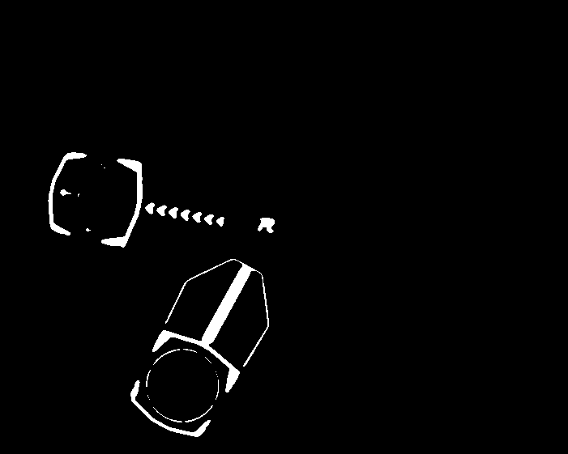

# 2024年笃行战队视觉组代码文档

# 等待修复

1. EKF所维护的运动模型有未可知的玄学问题，某些数值收敛过慢。
2. 自瞄维护的两个补偿值难以做到尽善尽美，火控框架仍有改进空间
3. Pnp解算得到的初始旋转角不够准确，得到位姿受曝光影响大，有较大优化空间。
4. 能量机关策略更新，加入支持神经网络的框架
5. 能量机关预测更新，以及部分的鲁棒性同步

# 简介

本文档主要介绍代码结构、代码流程、代码内容、算法原理、调参细节与其他内容。

# 环境依赖

1. MVS，可以前往[HIKROBOT官网](https://www.hikrobotics.com/cn/machinevision/service/download?module=0)找到Linux版本的MVS进行下载，之后解压压缩包，运行压缩包中的setup.sh即可。
2. glog，`sudo apt-get install libgoogle-glog-dev`。
3. Eigen3，`sudo apt-get install libeigen3-dev`。
4. ceres，通过 `sudo apt-get install`确保已经下载依赖 `libgoogle-glog-dev`、`libgflags-dev`、`libatlas-base-dev`、`libeigen3-dev`、`libsuitesparse-dev`，之后前往github中[ceres主页](https://github.com/ceres-solver/ceres-solver/tags)下载ceres1.1.4，使用cmake编译的方式安装。
5. openvino，下载[官方密钥](https://apt.repos.intel.com/openvino/2021/GPG-PUB-KEY-INTEL-OPENVINO-2021)，之后依次输入以下指令 `sudo apt-key add <PATH_TO_DOWNLOADED_GPG_KEY>`，`echo "deb https://apt.repos.intel.com/openvino/2021 all main" | sudo tee /etc/apt/sources.list.d/intel-openvino-2021.list`，`sudo apt update`、`sudo apt install intel-openvino-runtime-ubuntu20-2021.4.752`，其中可能在echo这一步骤出错，导致update无法进行，则删除list文件之后使用 `gedit`或者 `vim`指令手动创建，然后输入echo的内容。
6. opencv，使用openvino自带的opencv。为了播放视频，需要安装依赖：`sudo apt-get install gstreamer1.0-libav`

# 代码结构

本代码当前的代码结构如下：

```bash
.
├── AimautoConfig.yaml
├── armor
│   ├── CMakeLists.txt
│   ├── include
│   │   ├── AimAuto.hpp
│   │   ├── armor.hpp
│   │   ├── detector.hpp
│   │   ├── KalmanFilter.hpp
│   │   ├── K_Means_2.hpp
│   │   ├── number_classifier.hpp
│   │   ├── ovalene.hpp
│   │   ├── pnp_solver.hpp
│   │   ├── PredictShow.hpp
│   │   ├── tracker.hpp
│   │   └── vyaw.hpp
│   └── src
│       ├── AimAuto.cpp
│       ├── detector.cpp
│       ├── KalmanFilter.cpp
│       ├── number_classifier.cpp
│       ├── pnp_solver.cpp
│       ├── Predict.cpp
│       └── tracker.cpp
├── autostart.sh
├── camera
│   ├── CMakeLists.txt
│   ├── include
│   │   └── camera.hpp
│   └── src
│       └── camera.cpp
├── CMakeLists.txt
├── config
│   ├── detect.yaml
│   ├── Path.yaml
│   ├── WMConfigBlue.yaml
│   ├── WMConfigBlue（备份）.yaml
│   ├── WMConfigRed.yaml
│   └── WMConfigRed（备份）.yaml
├── main.cpp
├── model
│   ├── label.txt
│   ├── mlp.onnx
│   ├── wm_0524_4n_416.bin
│   ├── wm_0524_4n_416_int8.bin
│   ├── wm_0524_4n_416_int8.xml
│   └── wm_0524_4n_416.xml
├── params
│   ├── CMakeLists.txt
│   ├── include
│   │   ├── common.hpp
│   │   ├── gaoning.hpp
│   │   ├── globalParam.hpp
│   │   ├── globalParamInit.hpp
│   │   ├── globalText.hpp
│   │   ├── monitor.hpp
│   │   └── UIManager.hpp
│   └── src
│       ├── gaoning.cpp
│       ├── globalParamInit.cpp
│       ├── monitor.cpp
│       └── UIManager.cpp
├── readme.md
├── readme_src
│   ├── code_struct.png
│   └── WM.png
├── recompile.sh
├── restart.sh
├── serialPort
│   ├── CMakeLists.txt
│   ├── include
│   │   ├── MessageManager.hpp
│   │   └── SerialPort.hpp
│   └── src
│       ├── MessageManager.cpp
│       └── SerialPort.cpp
├── setup.sh
└── windmill
    ├── CMakeLists.txt
    ├── include
    │   ├── WMFunction.hpp
    │   ├── WMIdentify.hpp
    │   ├── WMInference.hpp
    │   └── WMPredict.hpp
    └── src
        ├── WMFunction.cpp
        ├── WMIdentify.cpp
        ├── WMInference.cpp
        └── WMPredict.cpp
```

本代码框架使用嵌套的CMakeLists，即将整体程序分为多个功能包，每个功能包含有include和src文件夹，各自通过CMakeLists进行管理。

## armor

本文件夹为自瞄功能包，其可以通过输入的图片，识别其中的装甲板并且返回装甲板中心在相机坐标系下的三维坐标。

## camera

本文件夹为相机取流功能包，其可以通过句柄打开海康MVS相机，并且可以通过MVS提供的相关API进行取流

## CMakeLists.txt

CMakeLists，用于编译代码，进行相关配置，同时在其中可以修改宏定义

## config

本文件夹中储存yaml格式的配置文件

## log

本文件夹中储存程序运行时输出的日志

## main.cpp

主程序，运行时运行此代码

## model

本文件夹中储存代码中需要的推理使用的模型

## params

本文件夹为功能功能包，包含全局参数结构体、全局地址结构体、功能函数等

## readme.md

本文件，readme文档，介绍整体的代码

## readme_src

本文件夹为readme所需要的资源的文件夹，主要存放图片

## restart.sh

程序执行的脚本，保证程序能找到对应的串口并且连接，同时退出程序之后可以重启程序

## serialPort

本文件夹为串口通信功能包，其可以通过初始化串口，来对于串口信息进行读和写操作

## setup.sh

初始化文档，在放入新环境后执行一次，用于将当前用户加入dialout用户组

## windmill

本文件夹为能量机关(打符)功能包，其可以通过输入图片，识别其中的能量机关的状态，并且通过弹速等信息，返回一定时间后云台需要旋转至并且开火的角度变化量

# 代码流程


# 通信协议

通信协议为23位，分为电控发给视觉的信息、打符时视觉发给电控的信息、自瞄时视觉发给电控的信息

## 电控发给视觉的信息

| 信息含义  | 长度 | 数据类型 | 单位 |
| --------- | ---- | -------- | ---- |
| pitch角   | 4    | float    | 弧度 |
| yaw角     | 4    | float    | 弧度 |
| 弹速      | 4    | float    | m/s  |
| 状态位    | 1    | uint8_t  | /    |
| 当前时间  | 4    | uint32_t | ms   |
| 预测时间  | 4    | uint32_t | ms   |
| crc校验位 | 2    | uint16_t | /    |

其中预测时间留空，无意义。

## 打符时视觉发给电控的信息

| 信息含义    | 长度 | 数据类型 | 单位 |
| ----------- | ---- | -------- | ---- |
| 绝对pitch角 | 4    | float    | 弧度 |
| delta yaw角 | 4    | float    | 弧度 |
| 弹速        | 4    | float    | m/s  |
| 状态位      | 1    | uint8_t  | /    |
| 当前时间    | 4    | uint32_t | ms   |
| 预测时间    | 4    | uint32_t | ms   |
| crc校验位   | 2    | uint16_t | /    |

## 自瞄时视觉发给电控的信息(有用)

| 信息含义                              | 长度 | 数据类型 | 单位     |
| ------------------------------------- | ---- | -------- | -------- |
| x_a:装甲板中心预测点在相机坐标系下的x | 4    | float    | mm       |
| y_a:类似x_a                           | 4    | float    | mm       |
| z_a:类似x_a                           | 4    | float    | mm       |
| armor_flag:是否开火状态位             | 1    | uint8_t  | /        |
| vx_c:平动瞄准补偿                     | 4    | float    | 比例系数 |
| vy_c:旋转瞄准补偿                     | 4    | float    | 比例系数 |
| crc校验位                             | 2    | uint16_t | /        |

## 状态位含义

| 数字 | /5 | %5 | 颜色(己方) | 状态     |
| ---- | -- | -- | ---------- | -------- |
| 0    | 0  | 0  | 红色       | 自瞄     |
| 1    | 0  | 1  | 红色       | 击打小符 |
| 2    | 0  | 2  | 红色       | /        |
| 3    | 0  | 3  | 红色       | 击打大符 |
| 4    | 0  | 4  | 红色       | /        |
| 5    | 1  | 0  | 蓝色       | 自瞄     |
| 6    | 1  | 1  | 蓝色       | 击打小符 |
| 7    | 1  | 2  | 蓝色       | /        |
| 8    | 1  | 3  | 蓝色       | 击打大符 |
| 9    | 1  | 4  | 蓝色       | /        |

# 代码内容

## 常见自定义数据类型

### GlobalParam

全局参数结构体，其中存放一切可能更改的参数。

### Translator

串口消息联合体，其联合内容包括一个长度为23的字符数组、一个自瞄时的结构体、一个打符时的结构体。

# 调参细节

本部分主要讲解调参使用的技巧以及内容。

在宏定义中开启DEBUGMODE就可以在左上角看到调参界面，使用RF两个键进行换行，使用ZC两个键进行换页，使用UJ两个键进行细微参数变更，其中U为增加J为减少，使用IK两个键进行大幅度参数变更，其中I为增加K为减少，在文件 `params/UIManager.cpp`中可以找到相关的键位，使用查找加统一替换可以改为你想要的键位，之后编译即可。

## 能量机关调参

能量机关调参主要分为两个步骤：

1. 形状正确。需要通过调整HSV以及膨胀腐蚀使得图像内应该联通的部分联通，应该断开的地方断开。其中需要调整的是膨胀腐蚀参数中的dialte1(此参数如今代表腐蚀)，以及HSV的阈值，直到效果如下，要求是待击打装甲板的灯条不连在一起，但是其中的一小块与击打板的下帽连接是可以被允许的，同时已经被激活的装甲板的柄需要和击打板的下帽连接在一起。

   
2. 图像特征正确。值得一提的是如今虽然依然有对于armor的显示，但是如今已经不会对于armor进行任何的操作，而是只对于R这一显示进行findContours的操作。图像的特征调整的是位于第三页以及第五页的对于hat以及R的筛选，其中调参的方法是将参数尽可能的扩大，在被识别的目标会被带有颜色的轮廓框住(hat是蓝色，R是红色)，同时会显示其参数，其中R从上到下的参数依次为面积、紧致度、圆度，而hat从上到下的参数依次为面积、长宽比、面积比(轮廓面积/最小外接矩形面积)，之后在调参界面中调整相关的参数对这些值进行收束，最后拍照记录，在 `config`文件夹中的对应yaml文件中修改参数。
